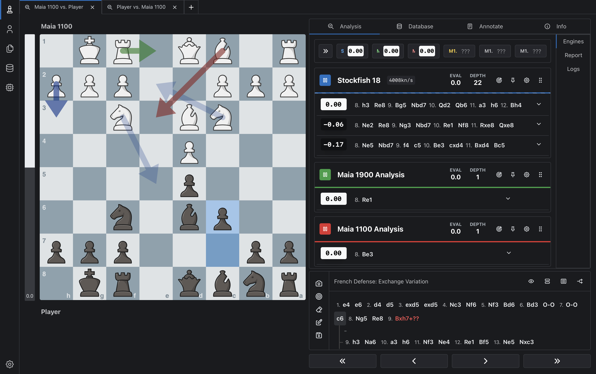

# maia2-local-stack

Run [Maia 2](https://www.maiachess.com/) locally as a UCI chess engine, with opening books built from Lichess games filtered by rating and support for side-by-side analysis with Stockfish.

Maia 2 is a neural network from the University of Toronto's CSSLab that predicts likely human moves at a given rating. This repository packages Maia 2 for local use with En Croissant or any UCI-compatible GUI, adds optional opening-book support, and provides Linux and Apple Silicon macOS setup paths.

## Screenshot



---

## Features

- **Rating-targeted play** from 600 to 2600
- **Opening books** weighted by how often real players at your level actually choose each move
- **HumanTime** — optional thinking delays (0.5–15 seconds, scaled by position complexity)
- **Multi-engine analysis** — run Maia and Stockfish side by side
- **Separate blitz and rapid engines** — Maia 2 has distinct weight files for each time control
- Works with **[En Croissant](https://encroissant.org/)** or any UCI-compatible chess GUI
- Runs on **Linux** (Pop!_OS / Ubuntu 24.04) and **macOS** (Apple Silicon with MPS acceleration)

---

## Quick start — Linux

```bash
git clone https://github.com/Dash1971/maia2-local-stack.git
cd maia2-local-stack
chmod +x *.sh

./setup-maia2.sh      # installs Maia 2, wrapper, Stockfish, En Croissant
./build-books.sh      # interactive book builder
```

The book builder prompts for target rating(s), time control, download size, and which Lichess monthly archive to use. Default is `1400,1600,1800` across all time controls from 5 GB of January 2024 data.

Then point En Croissant at `~/chess/maia2-engine/maia2-engine.sh` with BookFile set to your generated `.bin`. See [GUIDE.md](GUIDE.md) for the complete walkthrough.

## Quick start — macOS (Apple Silicon)

```bash
# Install Homebrew first if you don't have it:
/bin/bash -c "$(curl -fsSL https://raw.githubusercontent.com/Homebrew/install/HEAD/install.sh)"

# Then:
git clone https://github.com/Dash1971/maia2-local-stack.git
cd maia2-local-stack
chmod +x *.sh

./setup-maia2.sh      # auto-detects macOS, uses brew + MPS
./build-books.sh      # same script works on both platforms
```

Plus one manual step: download the [En Croissant .dmg for Apple Silicon](https://github.com/franciscoBSalgueiro/en-croissant/releases) and drag it to Applications (macOS doesn't allow scripted .dmg installs).

See [GUIDE-macOS.md](GUIDE-macOS.md) for the full walkthrough, including Stockfish workaround for Apple Silicon.

---

## What's in the repo

| File | Purpose |
|---|---|
| `setup-maia2.sh` | Cross-platform installer (Linux via apt, macOS via brew) — Maia 2, UCI wrapper, Stockfish, venv |
| `maia2_uci.py` | UCI engine wrapper (book support, HumanTime, analysis mode, flat eval) |
| `build-books.sh` | Interactive book builder — downloads Lichess data, streams through Python, writes `.bin` books |
| [`GUIDE.md`](GUIDE.md) | Full Linux setup guide |
| [`GUIDE-macOS.md`](GUIDE-macOS.md) | Full macOS setup guide (Apple Silicon / MPS) |

---

## Book-builder pipeline

```
Lichess .pgn.zst → curl (5 GB slice) → zstdcat → Python (in-memory) → .bin books
```

The builder downloads a portion of a Lichess monthly archive (you choose 2/5/10 GB), streams the decompressed PGN through Python, and keeps move-frequency stats in memory per rating bucket. When the stream ends, it writes one Polyglot `.bin` file per requested rating.

**Key details:**

- **Multiple ratings in one pass.** Ask for `1400,1600,1800` and each game gets counted in every bucket its average rating falls into (±100 by default). The download only happens once.
- **Choose your data source.** The builder prompts for a Lichess monthly archive (e.g. `2024-01`, `2025-06`). Recent months have more games. Default is `2024-01`. Browse available months at [database.lichess.org](https://database.lichess.org).
- **Proportional weight scaling.** The most-popular move in any position gets the Polyglot max weight of 65,535, and everything else is scaled proportionally — so popular first moves don't all cap at the same value.
- **PyPy auto-detected.** If `pypy3` is installed with the `chess` package, the builder uses it for 3-5x speedup. Otherwise falls back to the CPython venv created by the setup script.
- **Ctrl-C safe.** If you abort mid-stream, it still writes books with whatever data it has collected.

---

## Suggested calibration

These settings are starting points, not measured equivalences. In practice, many users will want to set Maia below their own rating.

| Your Rating | Set Maia ELO To |
|:-:|:-:|
| 1200 | 800 |
| 1400 | 1000 |
| 1600 | 1200 |
| 1800 | 1400 |
| 2000 | 1700 |

Adjust by roughly ±200 based on results. For higher ratings (2200+), the gap may narrow.

---

## Analysis workflow

Set up two Maia engines in En Croissant:

1. **Maia 2 (play)** — `HumanTime=true`, BookFile set, Depth=1
2. **Maia 2 Analysis** — `HumanTime=false`, no BookFile, Depth=1

Plus Stockfish for objective evaluation. In the Analysis panel, add both Stockfish and Maia 2 Analysis. As you step through a game:

- **Stockfish** says what's objectively best
- **Maia** says what a human at your target rating would actually play

Use this to compare likely human choices against engine-best moves.

## Limitations

- The repository copy of `maia2_uci.py` is a source file; `setup-maia2.sh` generates the installed wrapper used under `~/chess/maia2-engine/`.
- The calibration table is heuristic.
- The setup scripts have been syntax-checked, but not every platform path is continuously tested in this repository.

---

## Credits

- **[Maia 2](https://www.maiachess.com/)** by CSSLab, University of Toronto — the neural network that makes this possible
- **[En Croissant](https://encroissant.org/)** by Francisco Salgueiro — the GUI
- **[Lichess](https://lichess.org/)** — the game database (released under CC0)
- **[python-chess](https://python-chess.readthedocs.io/)** — board representation, zobrist hashing, Polyglot reading

---

## License

MIT for scripts and wrapper code in this repo. Maia 2 model weights have their own license — see the [Maia chess repo](https://github.com/CSSLab/maia-chess). Lichess data is CC0.
